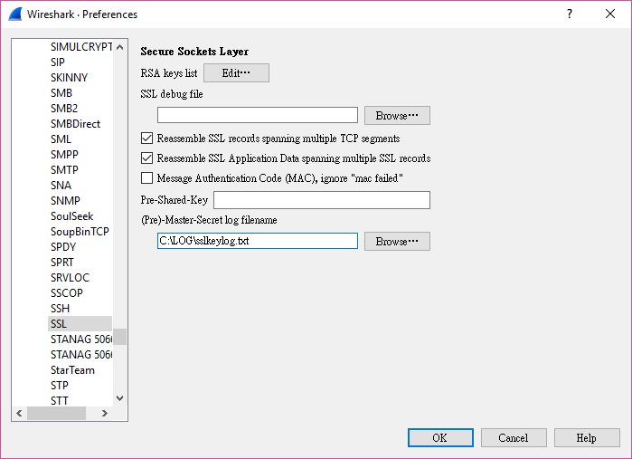
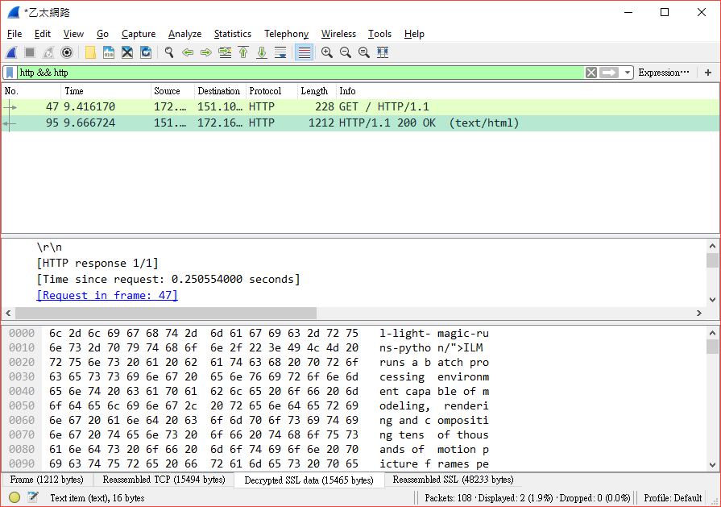

# openssl-keylog

In this folder, it contains a "quick" patch to enable the SSL packet descryption
with Wireshark in Windows.

This modification is based on Lucasa's [openssl #PR 1646](https://github.com/openssl/openssl/pull/1646).

<b>NOTE</b>
* If you are familiar with the build Python package, you can just patch s2_both.c and ignore the following gargage.
* Only perform roughly testing on Windows 7 and 10, use it on your own risk. 
* This patch is appplied and tested ONLY on openssl-1.0.2j 

## Prerequisite

* Comiler: VS2008 SP1 and VS2010 SP1 both installed (<b>MUST upgrade to SP1 !!!</b>)
* The source of Python-2.7.12 is unzip at c:\tmp\Python-2.7.12
* Python 2.7.12 is compiled and installed at C:\Python27

## Files
* <b>updatepcb.bat</b>:
  Update the files in Python source package 
* <b>cppython.bat</b>:
  >copy complied Python package to C:\Python27 (..... because I don't know 
  how to build .msi installer)	
* <b>updatesrc.bat</b>:
  > script to update modified source to Python source tree (s3_both.c) 
* <b>copylib.bat</b>:
  > script to copy only compiled SSL related library to C:\Python27  
* <b>s3_both.c</b>
  > Modified openssl source file to support key log (used to replace the one in C:\tmp\Python-2.7.12\externals\openssl-1.0.2j\ssl)
* <b>PCBuild\get_externals.bat</b>
  > Updated Python's script to support openssl-1.0.2j, sqlite-3.14.2.0
* <b>PCBuild\python.props</b>
  > Updated VC property file to support openssl-1.0.2j, sqlite-3.14.2.0

## Procedure

Download and unzip [Python-2.7.12](https://www.python.org/ftp/python/2.7.12/Python-2.7.12.tgz) to C:\tmp\Python-2.7.12, and then: 

```
updatepcb.bat
cd C:\tmp\Python-2.7.12\PCBuild
get_externals.bat
updatesrc.bat
build.bat -e
cppython.bat
```
    
## Testing

* Start Wireshark capture, and enable SSL key log:




* Open a DOS commands window and set environment variable to enable key log
```
set TCL_LIBRARY=C:\Python27\tcltk\lib\tcl8.5
set SSLKEYLOGFILE=c:\LOG\sslkeylog.txt    
```
* Test with Python

```
>>> import requests
>>> requests.get("https://www.python.org")
<Response [200]>
>>>
```
Stop Wireshark capture, and check the packets are decrypted in Wireshark.



## Rebuild (If you python is installed or built before)

After modify source in c:\tmp\Python-2.7.12\externals\ssl folder
```
cd C:\tmp\Python-2.7.12\PCBuild 
del libeay.lib libssl.lib _ssl.pyd
build -e
```
Build without error:
```
copylib.bat
```

# Reference
* [Decrypting TLS Browser Traffic With Wireshark – The Easy Way!](https://jimshaver.net/2015/02/11/decrypting-tls-browser-traffic-with-wireshark-the-easy-way/)
* [NSS Key Log Format](https://developer.mozilla.org/en-US/docs/Mozilla/Projects/NSS/Key_Log_Format)
* [openssl #PR 1646](https://github.com/openssl/openssl/pull/1646)


